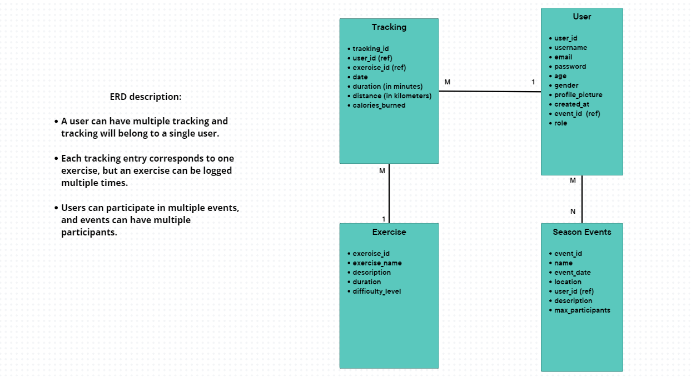
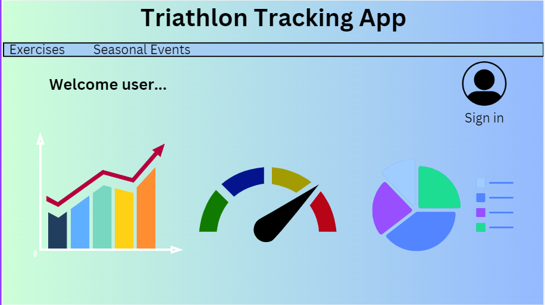
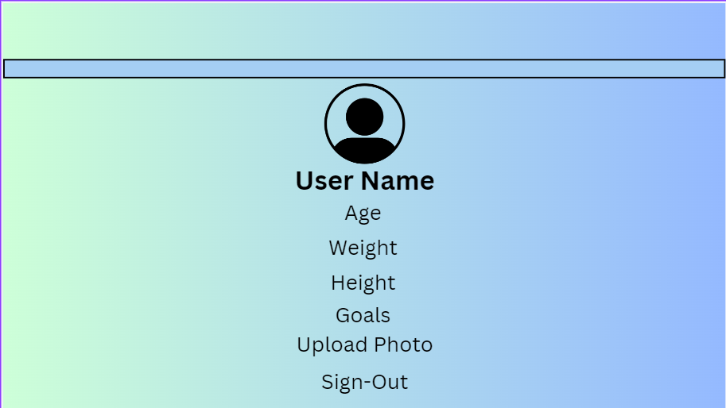
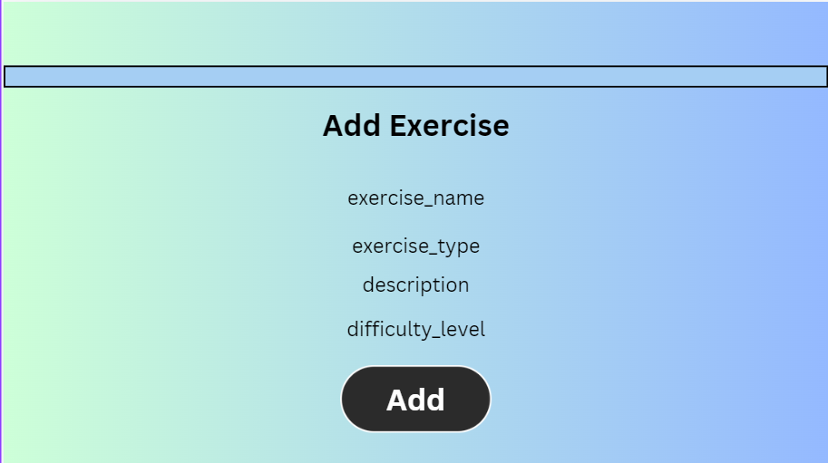
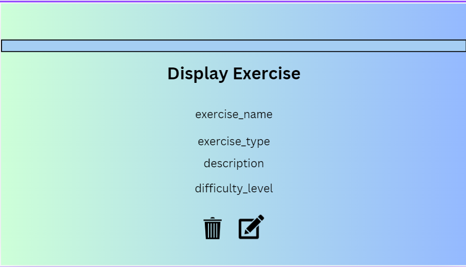
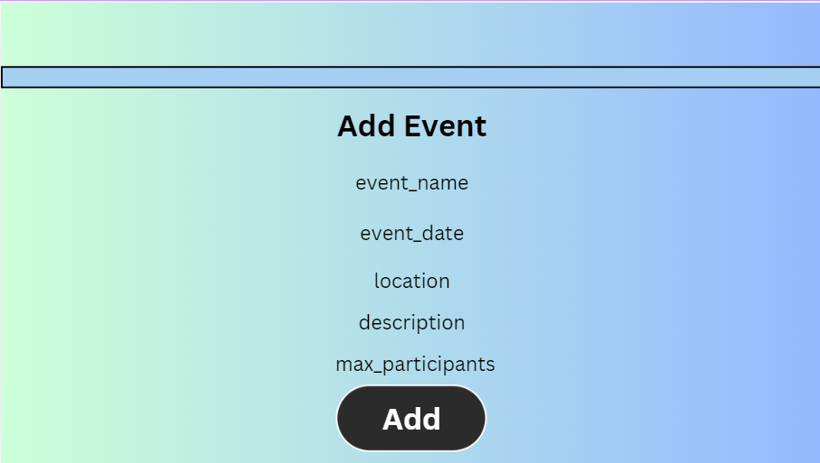
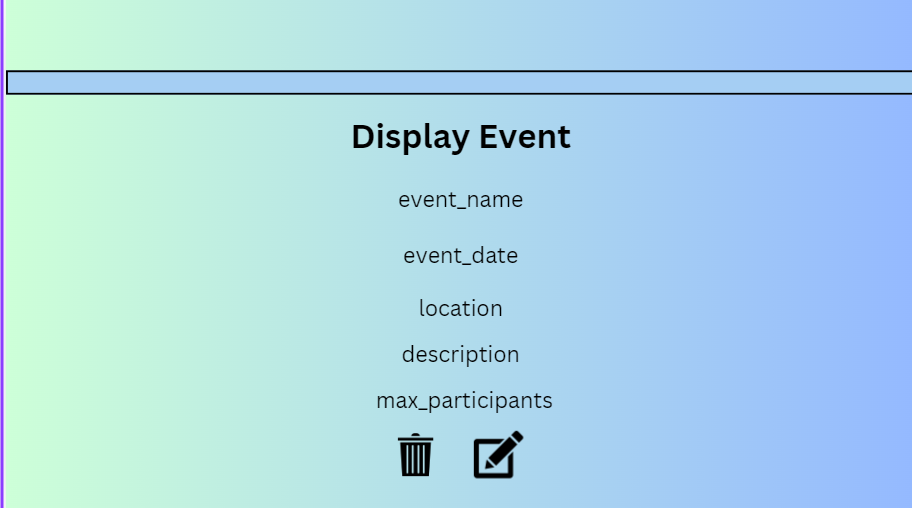
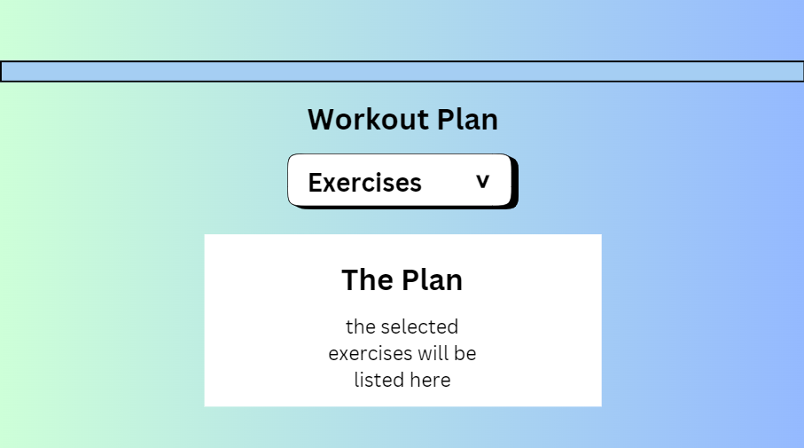

# Triathlon-Tracking-App

## Date: 3/10/2024

### By: Noor Aljirdabi | Muath AlSabbah | Hussain Jaffer

---

### **_Description_**

Project 2 for General Assembly bootcamp, Develop a full-stack web application that allows users to track their triathlon activities, manage profiles, and engage with additional resources like training plans and events.

---

### **_ERD_**

---

### **_Wireframe_**

---

### **_Technologies Used_**

- NodeJs
- Html
- Css
- Mongoose
- ExpressJs
- EJS
- Javascript

---

---

### **_Screenshots_**

---

### **_Future Updates_**

- [ ] Daily Training Reminders
- [ ] Display Upcoming Events

---
